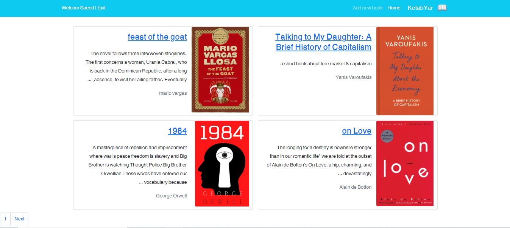
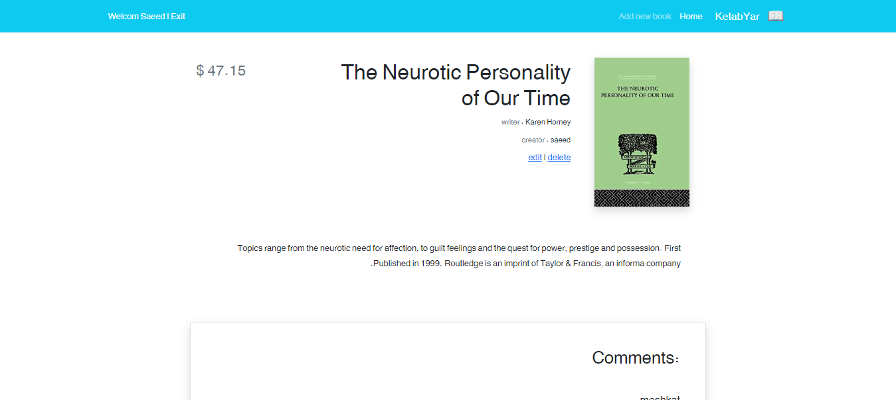
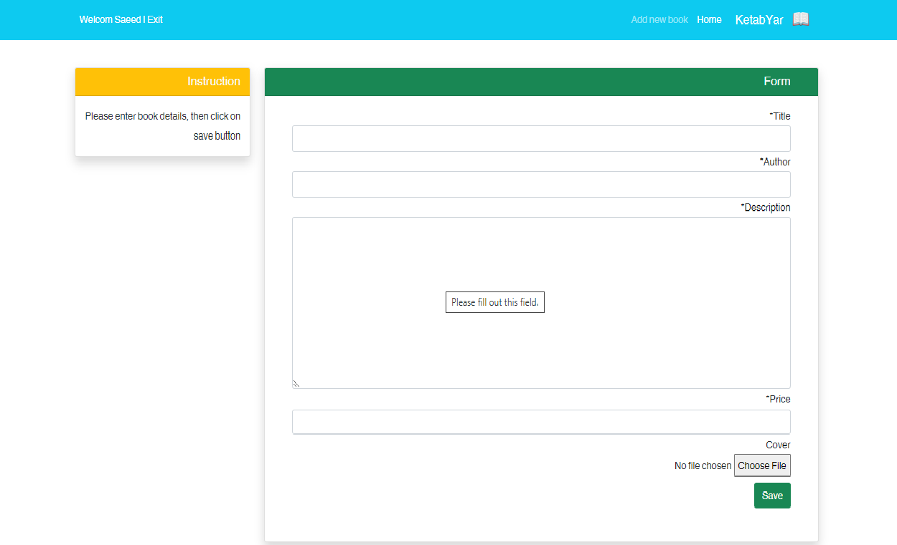

# BookStore-Django
A Simple BookStore Developed By Django

## Pictures
          |  .png)
:-------------------------------------------:|:------------------------------------------:
  |  

## Install & Run :
```
git clone https://github.com/bobbysaeed/BookStore-Django.git

cd bookstore

pip install -r requirements.txt

python manage.py makemigrations

python manage.py migrate

python manage.py runserver

```